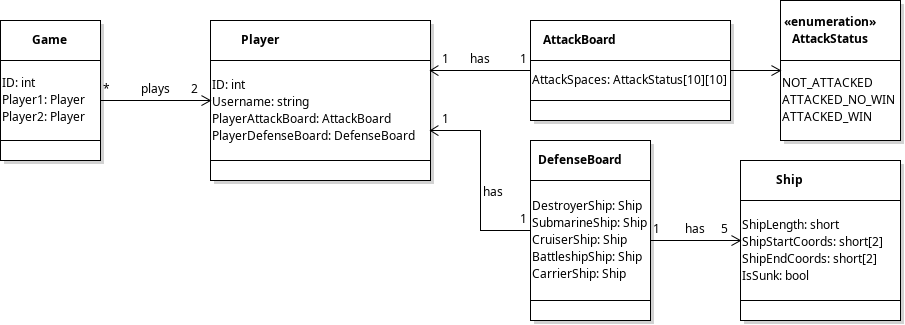
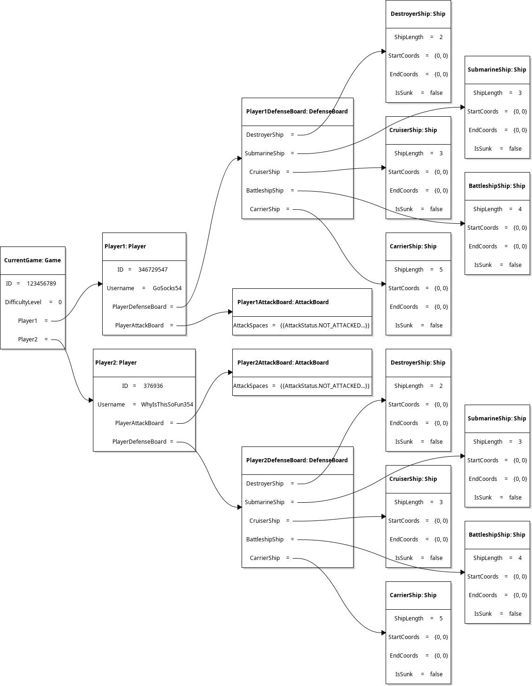
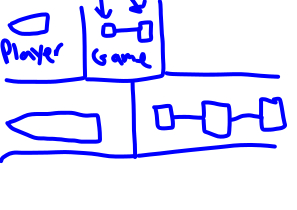

# Game Organization Discussion

We went through each of our UML diagrams and/or word documents to figure out which project organization solution would be best for our project.

## Samuel's UML Diagrams

### State Machine Idea

Samuel proposed that the game be divided into two components: one for the gui to manage user feedback events, and the main component to manage game states and/or other logic. The UML diagrams listed above only cover the core logic components (not the GUI).

## Lincoln's Proposal

- Create a fixed background (moving or fixed).
- Create a battlefield grid over the background.
- Create the ships by type, size, level, etc...
- Ships will be placed on top of a grid with an initial location, but they will be able to be moved in exchange for a turn?
- Set firing missles image and graphics mark up hits received by each ship and hits to enemy ships, quit game, new game.

### 2-Form System

Lincoln suggested that we ought to start with two forms (one for the menu and one for the game).

# Grid Logic Discussion

## Samuel's Solution

Samuel discussed the idea of using enumerations to handle the attack grid spaces. Each time the GUI is re-loaded (each turn), the enumeration would be re-read and possibly take up more resources.

A more-resourceful approach would be to keep two lists of coordinates: one to keep track of the hit spaces, and one to keep track of the missed spaces. In this approach, the grid spaces would be "not fired upon" by default.

## Lincoln's Idea

Lincoln created a graphic idea representing the separation between the game logic and the windows.

# Collaboration Methods

We decided to meet regularly on the "Meeting Room 1" channel as agreed upon on the Discord server chat.

# Homework

- All of us will look into using git and github for version control/project management.
- Each of us will work on implementing the UML diagram discussed using our own systems. We will reconvene as discussed in the discord room.
