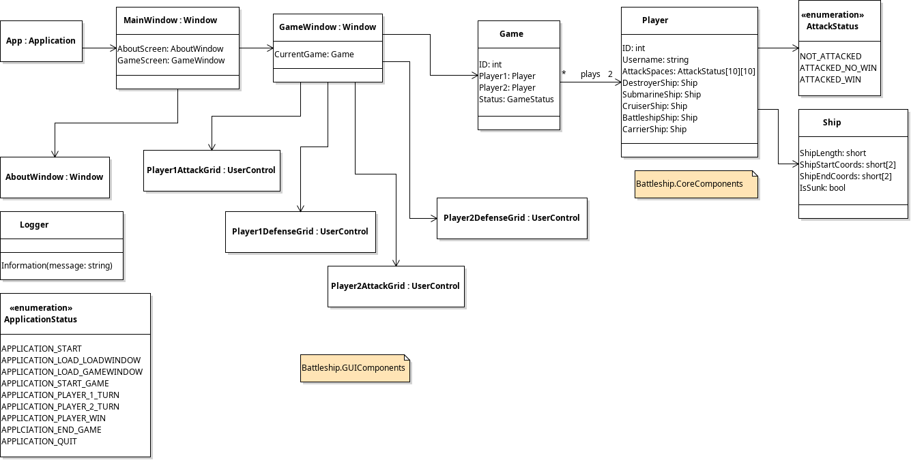
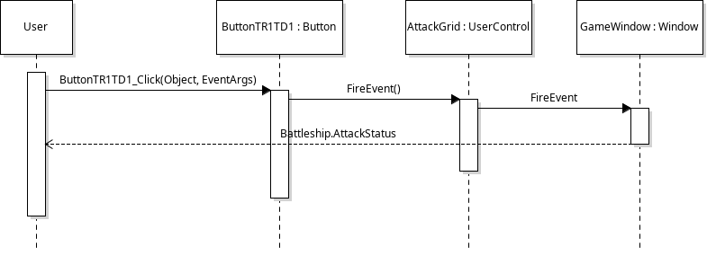

# Problems Our Group Is Facing

## Logistical Problems
- We need to get on the same page in project architecture.
- To do this, we need to create more UML diagrams. This includes...
    - class diagrams for the main project architecture, and...
    - sequence diagrams for event handlers.

We need to recreate these diagrams and post the most up-to-date one on the project website whenever our group decides to make a change. Maybe this means other UML tools that are easier to use (such as DrawIO, Lucid Chart, PlantUML, etc.)

## Code Problems

### Catch-Up

#### Ship Placement
- [X] Place multiple ships on the board
- [ ] Rotate ships on the board
- [ ] Detect the location of these ships

#### Turn-By-Turn Gameplay
- [X] Two-player-compatible GUI
- [ ] Event handlers/listeners to detect ship firing (and it's corresponding win/loss event)

### Going Forward on Week 3

## Code Proposals

### UML Class Diagram

### Explanation
I (Samuel) propose that we instantiate a Game object from the GameWindow class, and reference that object through event listeners.

For example, if one of the squares on Player1's AttackGrid, it should send an event back to the GameWindow, which would check to see if the attack was a hit or miss on Player2's DefenseGrid.

